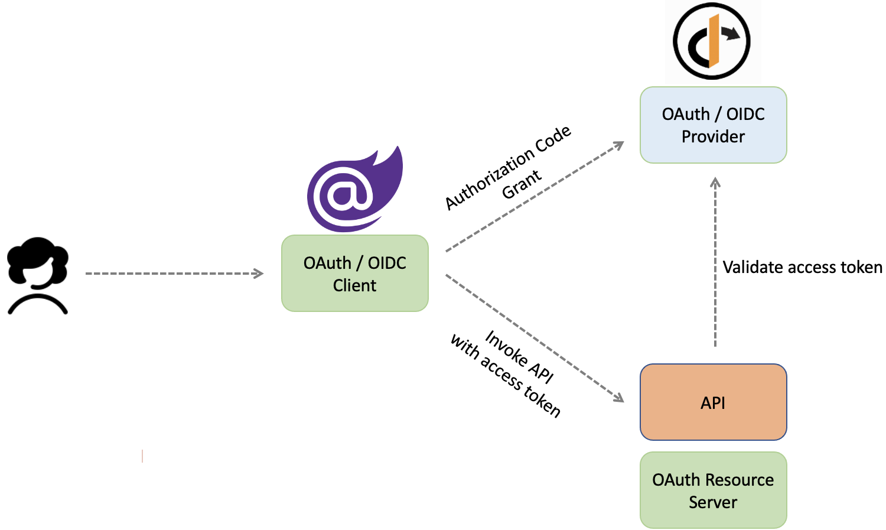

 # Blazor WebAssembly application using the Clean Architecture template

This is solution implements a Single Page App (SPA) with Blazor WebAssembly and ASP.NET Core following the principles of [Clean Architecture](https://jasontaylor.dev/clean-architecture-getting-started/).

## Technologies

* Web API using [ASP.NET Core 6](https://docs.microsoft.com/en-us/aspnet/core/introduction-to-aspnet-core?view=aspnetcore-6.0)
* Open API with [NSwag](https://github.com/RicoSuter/NSwag)
* Data access with [Entity Framework Core 6](https://docs.microsoft.com/en-us/ef/core/)
* [Dynamic LINQ](https://dynamic-linq.net/)
* [Database projects and data-tier applications (DAC)](https://docs.microsoft.com/en-us/visualstudio/data-tools/creating-and-managing-databases-and-data-tier-applications-in-visual-studio)
* UI using [Blazor WebAssembly](https://dotnet.microsoft.com/en-us/apps/aspnet/web-apps/blazor)
* Complex data filtering with [Radzen Blazor Components](https://blazor.radzen.com/)
* CQRS pattern with [MediatR](https://github.com/jbogard/MediatR)
* Object-Object Mapping with [AutoMapper](https://automapper.org/)
* Validation with [FluentValidation](https://fluentvalidation.net/)
* Automated testing with [NUnit](https://nunit.org/), [FluentAssertions](https://fluentassertions.com/), [Moq](https://github.com/moq)

## Getting Started

1. Install the latest [.NET 6 SDK](https://dotnet.microsoft.com/download/dotnet/6.0)
2. Clone project
3. Create an empty Database
4. Publish the database project to the newly created database
5. Run IdentityServer4
6. Navigate to `src/WebUI` and run `dotnet run` to launch the back end (ASP.NET Core Web API)

## Architecture Overview

With Clean Architecture, the Domain and Application layers are at the centre of the design. This is known as the Core of the system.

The Domain layer contains enterprise logic and types and the Application layer contains business logic and types. The difference is that enterprise logic could be shared across many systems, whereas the business logic will typically only be used within this system.

Core should not be dependent on data access and other infrastructure concerns so those dependencies are inverted. This is achieved by adding interfaces or abstractions within Core that are implemented by layers outside of Core. For example, if you wanted to implement the Repository pattern you would do so by adding an interface within Core and adding the implementation within Infrastructure.

All dependencies flow inwards and Core has no dependency on any other layer. Infrastructure and Presentation depend on Core, but not on one another.

### Domain

This will contain all entities, enums, exceptions, interfaces, types and logic specific to the domain layer.

### Application

This layer contains all application logic. It is dependent on the domain layer, but has no dependencies on any other layer or project. This layer defines interfaces that are implemented by outside layers. For example, if the application need to access a notification service, a new interface would be added to application and an implementation would be created within infrastructure.

### Infrastructure

This layer contains classes for accessing external resources such as file systems, web services, smtp, and so on. These classes should be based on interfaces defined within the application layer.

### WebUI

This layer is a single page application based on Blazor WebAssembly and ASP.NET Core 6. This layer depends on both the Application and Infrastructure layers, however, the dependency on Infrastructure is only to support dependency injection. Therefore only *Startup.cs* should reference Infrastructure.

This results in architecture and design that is:

1. Independent of frameworks it does not require the existence of some tool or framework
2. Testable easy to test – Core has no dependencies on anything external, so writing automated tests is much easier
3. Independent of UI logic is kept out of the UI so it is easy to change to another technology – right now you might be using Angular, soon Vue, eventually Blazor!
4. Independent of the database data-access concerns are cleanly separated so moving from SQL Server to CosmosDB or otherwise is trivial
5. Independent of anything external in fact, Core is completely isolated from the outside world – the difference between a system that will last 3 years, and one that will last 20 years

## WebAssembly

WebAssembly is a new type of code that can be run in modern web browsers — it is a low-level assembly-like language with a compact binary format that runs with near-native performance and provides languages such as C/C++, C# and Rust with a compilation target so that they can run on the web. It is also designed to run alongside JavaScript, allowing both to work together.

WebAssembly has huge implications for the web platform — it provides a way to run code written in multiple languages on the web at near native speed, with client apps running on the web that previously couldn’t have done so.

WebAssembly is designed to complement and run alongside JavaScript — using the WebAssembly JavaScript APIs, you can load WebAssembly modules into a JavaScript app and share functionality between the two. This allows you to take advantage of WebAssembly's performance and power and JavaScript's expressiveness and flexibility in the same apps, even if you don't know how to write WebAssembly code.

And what's even better is that it is being developed as a web standard via the W3C WebAssembly Working Group and Community Group with active participation from all major browser vendors.

## Blazor WebAssembly
Blazor WebAssembly is a single-page app framework for building interactive client-side web apps with .NET. Blazor WebAssembly uses open web standards without plugins or code transpilation and works in all modern web browsers, including mobile browsers.

Blazor WebAssembly apps run on the browser(client). Since client-side code can be modified by a user, Blazor WebAssembly app can’t enforce authorization access rules. Authorization is only used to determine what to show on UI using the `[Authorize]` attribute and the `AuthorizeView` component.

### Advantages of using Blazor WebAssembly

1. Code is written in a strongly typed language (C#) which can prevent an entire class of bugs
2. The Client and the Server share the same which can help in keeping the validation consistent (a single source of truth)

### Blazor WebAssembly authentication and authorization
The app implements authentication and authorization via [OpenID Connect(OIDC)](https://openid.net/connect/) using [IdentityServer4(IDS4)](https://github.com/IdentityServer/IdentityServer4).

For authentication it is using Authorization Code flow on OpenID Connect. Bellow diagram is to show the code grant’s big picture:

Diagrams bellow are to demonstrate the Blazor WASM app’s behaviour on login and when user tries to access a protected resource:

Calling a protected API using an access token.

## References
1. https://developer.mozilla.org/en-US/docs/WebAssembly
2. https://webassembly.org/
3. https://github.com/jasontaylordev/CleanArchitecture
4. https://nahidfa.com/posts/blazor-webassembly-authentication-and-authorization-with-identityserver4/
5. https://identityserver4.readthedocs.io/en/latest/index.html
6. https://sandrino.dev/blog/aspnet-core-5-jwt-authorization
7. https://docs.microsoft.com/en-us/learn/paths/build-web-apps-with-blazor/
8. https://docs.microsoft.com/en-us/dotnet/architecture/modern-web-apps-azure/architectural-principles#dependency-inversion
9. https://www.youtube.com/watch?v=lRYrhj9lwQk
10. https://www.youtube.com/watch?v=VpEexGvZWSQ
11. https://www.youtube.com/watch?v=kesUNeBZ1Os

This project is licensed with the [MIT license](LICENSE).
